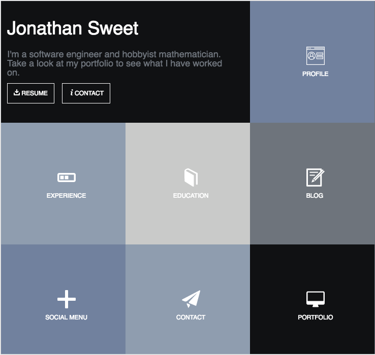
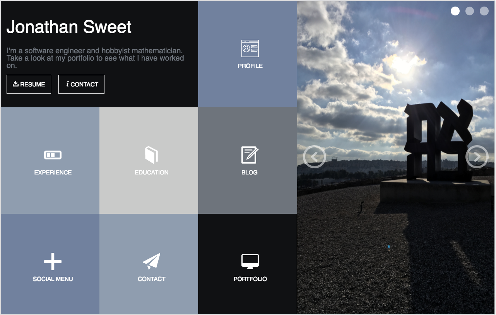

# Static Comp 1

## Overview
Static Comp 1 provides an opportunity to create a static page showcasing a topic with a simple box and image carousel layout. We have creative license over the color pallete, photo(s), icons, and text content so long as it doesn't completely stray from the spirit of the original comp shown below.

Original Comp: 

## Result 

I began with a mobile styling, 320x568 pixels. I took advantage of the default block styling of the `<article>` elements which make up the boxes below the #intro `<section>`. The image carousel sits below and is given 100vh so when the user scrolls down the image carousel takes up the full screen.

Scaling up from the mobile styling to screen widths above 550px, the contents of the `<main>` box section employs a flex wrap display and the intro section is given a 66% width while `<article>` boxes become square with a 33% width to fill the page. Contents of the article elements are flexed as well and centered horizontally and vertically. The image carousel below has it's width reduced so that the image does not appear stretched, is centered with margin, and empty space to the left and ride filled with the background color applied to the body of the page. 

Finally, at screens above 790px in width, the image carousel is given a width of 40% and inline-block display, the main flexed box section is given a width of 60% and floated to the left, thus allowing the carousel to join it inline with the main section. From here, further media queries for larger screens serve only to bump up the font size for easier reading.

Final Product:

